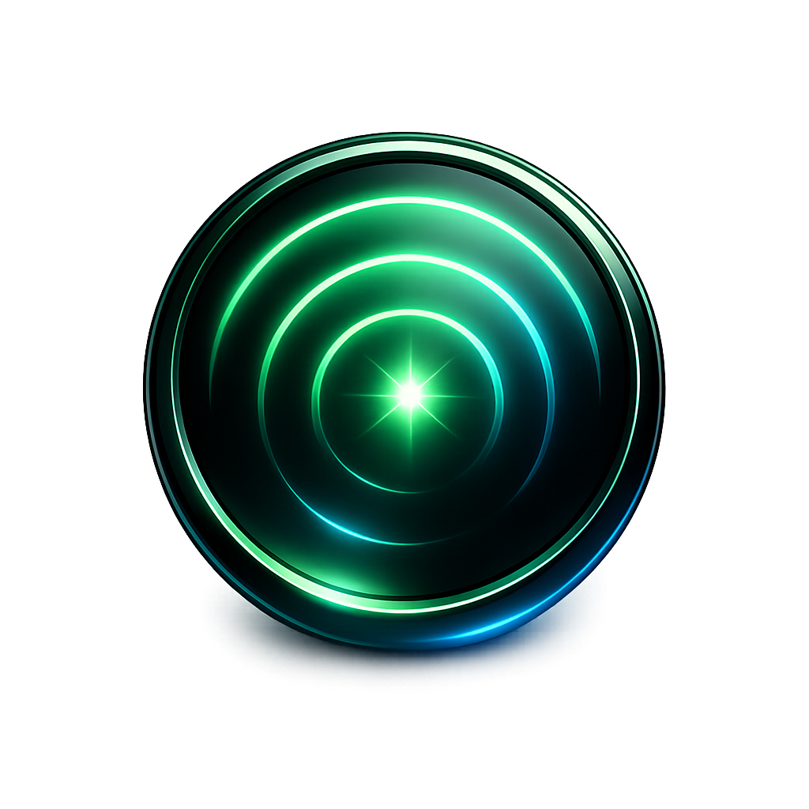

<p align="center">
  
</p>

<h1 align="center">Claude Control</h1>

<p align="center">
  A native macOS desktop app for monitoring and managing multiple <a href="https://docs.anthropic.com/en/docs/claude-code">Claude Code</a> sessions in real time.
</p>

When you're running several Claude Code instances across different repos and worktrees, it's hard to keep track of what each one is doing. Claude Control auto-discovers all running sessions and gives you a single dashboard with live status, git changes, conversation previews, and quick actions — without leaving the app.


## Features

- **Auto-discovery** — Detects all running `claude` CLI processes via the process table and maps them to their JSONL conversation logs
- **Live status** — Classifies each session as Working, Idle, Waiting (needs input), Errored, or Finished based on CPU usage, file modification times, and conversation state
- **Git integration** — Shows branch name, changed files, additions/deletions, and detects open pull requests via `gh`
- **PR status badges** — Live CI check rollup (passing/failing/pending), review decision, unresolved threads, merge conflicts, and merged/closed state
- **Task context** — Extracts Linear issue titles and descriptions from MCP tool results to show what each session is working on
- **Conversation preview** — Shows the last assistant message, active tool, and user prompt for each session
- **Approve/reject from dashboard** — Approve or reject tool-use permission prompts directly from the dashboard without switching to the terminal
- **Keyboard shortcuts** — Number keys (1-9) to select sessions, Tab/Shift+Tab to cycle, A/X to approve/reject, Enter to focus iTerm, E/G/F/P for editor/git/finder/PR
- **Desktop notifications** — Native macOS notifications when sessions finish working or need attention (configurable)
- **Notification sounds** — Subtle two-tone chime on status transitions (configurable)
- **Quick actions** — One-click buttons to focus the iTerm tab, open your editor, git GUI, Finder, or PR link for any session
- **Configurable tools** — Choose your preferred code editor (VS Code, Cursor, Zed, etc.), git GUI (Fork, Sublime Merge, etc.), and browser (Chrome, Arc, Safari, etc.)
- **New session creation** — Create new Claude Code sessions with git worktree support, repo browsing, and custom initial prompts
- **PR workflow** — Send `/create-pr` to idle sessions and see PR links once created
- **Worktree cleanup** — Remove worktrees, branches, and kill sessions with a two-step confirmation flow
- **Multi-monitor support** — Target which display apps open on

## Requirements

- **macOS** (uses AppleScript for iTerm integration, native folder picker, etc.)
- **Node.js** >= 18 (LTS 24 recommended — see `.node-version`)
- [**Claude Code CLI**](https://docs.anthropic.com/en/docs/claude-code) installed and running
- [**iTerm2**](https://iterm2.com/) (for terminal focus and session creation features)
- [**GitHub CLI**](https://cli.github.com/) (`gh`) for PR detection (optional)

A `.node-version` file is included for version managers like [fnm](https://github.com/Schniz/fnm) and [nvm](https://github.com/nvm-sh/nvm). With auto-switching enabled, both will pick up the correct version when you `cd` into the project. Otherwise, run `fnm use` or `nvm use`.

## Install from DMG

Download the latest `.dmg` from the [Releases](../../releases) page, open it, and drag the app to Applications.

> **Note:** The app is not notarized with Apple, so macOS will block it on first launch. To get past Gatekeeper, either right-click the app and select **Open**, or run:
> ```bash
> xattr -cr /Applications/Claude\ Control.app
> ```

## Build from source

```bash
# Clone the repo
git clone https://github.com/sverrirsig/claude-control.git
cd claude-control

# Install dependencies
npm install

# Run in development mode (hot-reload)
npm run electron:dev

# Or build a distributable DMG
npm run electron:build
```

The development server runs on port 3200. The Electron shell loads it automatically.

### Scripts

| Command | Description |
|---|---|
| `npm run electron:dev` | Dev mode with hot-reload (Next.js + Electron) |
| `npm run electron:build` | Production build → DMG + ZIP in `dist/` |
| `npm run electron:pack` | Production build → unpacked app in `dist/` |
| `npm run dev` | Next.js dev server only (no Electron shell) |
| `npm run build` | Next.js production build only |
| `npm run test` | Run unit tests (Vitest) |
| `npm run test:watch` | Run tests in watch mode |
| `npm run lint` | Run ESLint |
| `npm run typecheck` | Run TypeScript type checking |

## How it works

### Session discovery

1. Finds all processes named `claude` via `ps`
2. Filters out Claude Desktop (only CLI instances)
3. Gets each process's working directory via `lsof`
4. Maps the working directory to `~/.claude/projects/<escaped-path>/` to find conversation JSONL files
5. Reads the tail of each JSONL file to extract session state

### Status classification

| Status | Condition |
|---|---|
| **Working** | JSONL modified recently AND CPU > 5%, or CPU > 15% |
| **Waiting** | Last assistant message has a pending tool use (permission prompt) or is asking for user input |
| **Idle** | Process alive, low activity |
| **Errored** | Last message contains error indicators |
| **Finished** | Process no longer running |

### Architecture

```
Electron shell (macOS native window)
    ↓
Browser (SWR polls /api/sessions every 1s)
    ↓
Next.js API Routes (standalone server)
    ↓
┌──────────────────────────────────────────┐
│  discovery.ts  →  process-utils.ts       │  ps, lsof
│                →  paths.ts               │  ~/.claude/projects mapping
│                →  session-reader.ts       │  JSONL parsing
│                →  git-info.ts            │  git status, diff, PR detection
│                →  status-classifier.ts   │  Status state machine
└──────────────────────────────────────────┘
```

No database — all state is derived from the filesystem and process table on every request.

## First-time setup

On first launch, the app will ask you to select your code directory (the parent folder containing your git repos, e.g. `~/Code`). This is stored in `~/.claude-control/config.json` and used for the repo picker when creating new sessions.

You can add multiple code directories. The app scans up to two levels deep for git repositories.

## Project structure

```
├── electron/
│   └── main.js                  # Electron main process
├── src/
│   ├── app/
│   │   ├── page.tsx             # Dashboard
│   │   ├── session/[id]/        # Session detail view
│   │   ├── settings/            # Settings page
│   │   └── api/                 # API routes (sessions, actions, repos, PR status)
│   ├── components/              # React components
│   ├── hooks/                   # SWR hooks, keyboard shortcuts, notifications
│   └── lib/                     # Core logic (discovery, git, JSONL parsing)
├── scripts/
│   ├── prepare-build.js         # Assembles standalone Next.js app
│   └── after-pack.js            # Copies into Electron resources
└── public/
    └── icon.png
```

## Tech stack

- **Electron** — Native macOS window with hidden title bar
- **Next.js 14** (App Router, standalone output) — Serves both API and UI from a single process
- **TypeScript** (strict)
- **Tailwind CSS 3** — Dark theme
- **SWR** — Client-side polling with 1-second intervals

## Contributing

PRs welcome! To get started, clone the repo and run `npm run electron:dev` — that's it.

Some areas that could use work:
- Linux/Windows support (currently macOS-only due to AppleScript usage)
- Support for other terminals beyond iTerm2
- Session history and cost/token tracking
- See [IDEAS.md](IDEAS.md) for more feature ideas

## License

MIT
